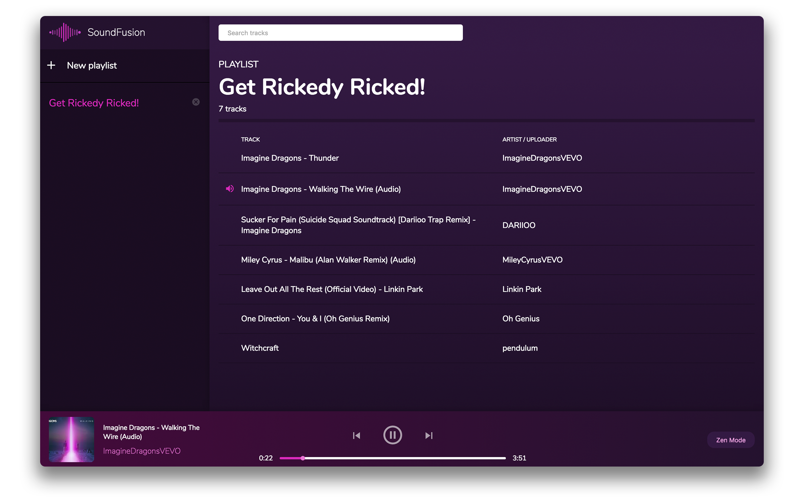

<p align='center'>
  
<p/>

# SoundFusion

SoundFusion is a music player app that finds tracks from various sources to create personal playlists (YouTube and SoundCloud at the moment).

The idea for this app was born from the desire to learn [Electron](https://github.com/electron/electron) and build my first desktop app ever.

<p align='center'>
  
<p/>

---

## Installation

Clone this repo:
```
$ git clone git@github.com:Temzasse/soundfusion.git
```

You can try the development version by following the **Development** section below.

Or you can build the "production" version:
```
$ TODO
```

## Development

Install dependencies:
```
$ npm install
```

Then start the Webpack dev server:
```
$ npm start
```

And after that has fired up start electron:
```
$ npm run electron-dev
```

And if you are on Windows:
```
$ npm run electron-dev:win
```

## TODO
- Getting dev setup up and running should not require two commands.
- Add more music sources (check out [Bandcamp](https://bandcamp.com/developer)).